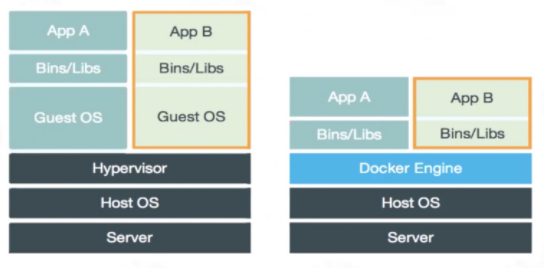

# 容器技术介绍之docker核心技术概述
容器简单来说是一种沙盒技术，将应用“装”进沙盒中，像集装箱一样，把应用封装起来，使得应用之间不会相互干扰，而放进沙盒中的应用也方便“搬家”。本文基于docker来介绍容器相关核心技术。

<!--more-->


## 容器技术发展简介

### IaaS、PaaS 和 SaaS

一切皆服务（X as a service，XaaS）是目前的大趋势，2022年1月12日，国务院发布的《“十四五”数字经济发展规划》强调要推动企业上云，推进云网协同与算网融合。很多企业将自己的服务部署到云端。常见的云服务模型包括三种：

- 基础设施即服务 (Infrastructure as a Service, IaaS)
- 平台即服务 (Platform as a Service, PaaS) 
- 软件即服务 (Software as a Service, SaaS) 

这三种云服务模型提供了不同级别的控制和管理，
- IaaS 为云服务提供硬件，包括服务器、网络和存储。由于它只提供底层资源，客户需要自己管理操作系统 、数据库、应用程序等，所以灵活性更高。常见的有阿里云，亚马逊 AWS、微软 Azure等，据国际权威机构Gartner 2021年12月15日发布的最新报告，阿里云IaaS基础设施在计算、存储、网络、安全四项核心评比中均斩获最高分，拿下全球第一。
- PaaS 除了提供 IaaS 可提供的硬件之外，还提供操作系统、中间件、数据库等。比如服务器平台，开发、部署环境。开发人员可以在其基础上开发或自定义基于云的应用程序，只负责应用程序、功能和数据，不需要关注底层，可以大大减少编码时间。PaaS平台一般支持应用程序的完整生命周期：生成、测试、部署、管理和更新，可以有效管理应用程序的生命周期。比如Google App Engine，上传应用程序到上面后就可以为用户提供服务。
- SaaS 提供了最多的支持，为用户提供除其数据之外的所有服务。比如百度云、阿里云等存储服务，电子邮件，QQ、微信等社交服务都属于SaaS。

这三种云服务模型特征可总结为下图：


<center><font size="2">图片来源：https://www.bmc.com/blogs/saas-vs-paas-vs-iaas-whats-the-difference-and-how-to-choose/</font></center>

### Cloud Foundry

很多用户通常是在本地开发环境开发好应用后将其部署到云上，而部署过程通常会碰到云端虚拟机和本地环境不一致的问题，前面介绍了PaaS 项目具有“**应用托管**”的能力，一些PaaS 项目可以有效解决这种环境问题，比如Cloud Foundry，开发人员只要执行一条命令（应用打包和分发）就能把本地的应用部署到云上。

Cloud Foundry需要启动不同用户上传的应用，如何做到相互不冲突呢？其实它调用了操作系统的 Cgroups 和 Namespace 机制为每一个应用单独创建一个称作“沙盒”的隔离环境，也就是“容器”。然后在容器中运行应用，实现多个应用互不干涉地在虚拟机中运行，后来出现的Docker 项目其实也是使用的这种思路。

### Docker 镜像

Cloud Foundry虽然部署方便，但是部署之前的准备，也就是打包比较麻烦，需要做很多的修改和配置。Docker也使用了Cloud Foundry容器使用的Cgroups 和 Namespace 机制来创建隔离环境，区别在于打包方式不一样，Docker使用Docker 镜像技术实现应用打包，直接使用 `docker build` 命令创建镜像，这也是docker流行的原因。

Docker 镜像包括了完整的操作系统文件和目录，包含了应用运行所需要的所有依赖，不需要进行进行任何配置或者修改，跟你本地开发和测试环境用的操作系统完全一样，本地环境和云端环境的高度一致。镜像制作完成后，在云端执行  `docker run 镜像名称` 就可以运行应用。

> Docker不能完全取代PaaS，因为它不能完成大规模应用部署。

### 容器编排

容器编排（Container Orchestration）是对容器的一系列定义、配置和创建动作的管理，实现对多个容器进行管理。Docker Compose可用来管理单个主机上的多个容器，Docker Swarm 是一款用来管理多主机上的Docker容器的工具，管理容器集群。

2014 年 6 月Google 公司推出了 Kubernetes 项目，构建出了一个与docker不同的容器编排与管理的生态，采用 Pod、Sidecar 等功能和设计模式，由于其先进的理念以及来自Google在容器化基础设施领域的多年实践经验，加上 Kubernetes 项目覆盖了足够多的场景，Docker Swarm 项目逐渐失势，Docker 公司选择逐步放弃开源社区而专注于自己的商业化转型。2017 年 10 月，Docker 公司在Docker 企业版中内置 Kubernetes 项目，标志着在容器编排中Kubernetes 取得全面胜利。


## 容器核心技术

下面以docker为例介绍容器是如何实现应用隔离以及资源限制的，了解Linux 容器的核心实现原理。

### 名称空间

名称空间（Namespace） 是容器用来实现隔离的技术，先来看个例子。

运行容器busybox，执行 `ps` 命令查看容器内进程：

```bash
$ docker run -it busybox /bin/sh
/ # ps
PID   USER     TIME  COMMAND
    1 root      0:00 /bin/sh
   11 root      0:00 ps
```

`-it` 一般一起使用，实现和docker容器进行交互。`-i` 表示以交互模式运行容器，`-t` 表示为容器分配一个伪输入终端。`/bin/sh` 是要在 Docker 容器里运行的程序。

容器内`/bin/sh`命令的进程ID为1，这表明容器里执行的`/bin/sh` 已经和宿主机"隔离"了，而在宿主机真实的进程空间里，这个进程的 PID 还是真实的数值，这就是Namespace 技术产生的效果，它只是修改了进程视图，容器内只能“看到”某些指定的进程。而对宿主机来说，这个`/bin/sh` 和其它进程没什么区别，我们可以在宿主机中查看这个`/bin/sh`进程的ID：

```bash
$ docker ps | grep busybox
ef0b47c6f9bb   busybox             "/bin/sh"                16 minutes ago   Up 16 minutes             hungry_booth
$ 
$ docker top ef0b47c6f9bb
UID                 PID                 PPID                C                   STIME               TTY                 TIME                CMD
root                8786                8768                0                   11:20               pts/0               00:00:00            /bin/sh
$ 
$ ps ajx | grep /bin/sh | grep -v grep
  2453   2584   2584   2584 ?            -1 Ss       0   0:00 /usr/bin/ssh-agent /bin/sh -c exec -l /bin/bash -c "env GNOME_SHELL_SESSION_MODE=classic gnome-session --session gnome-classic"
  8367   8750   8750   8367 pts/3      8750 Sl+      0   0:00 docker run -it busybox /bin/sh
  8768   8786   8786   8786 pts/0      8786 Ss+      0   0:00 /bin/sh
```

可以发现，容器中“看到”的`/bin/sh`进程在宿主机中的PID为8786。

Namespace 技术可以确保不同容器之间的网络、进程等相互隔离，使互相无法通信，无法感知。比如我再启动另外一个容器执行`/bin/sh`命令：

```bash
docker run -it rethinkdb /bin/sh
# ps
   PID TTY          TIME CMD
     1 pts/0    00:00:00 sh
     7 pts/0    00:00:00 ps
# 
```

可以发现它的PID还是1，也就是说既看不到宿主机里真正的进程空间，也看不到其他 Namespace 里的具体情况。

在宿主机查看它们的PID：

```bash
$ ps ajx | grep /bin/sh | grep -v grep
  8367   8750   8750   8367 pts/3      8750 Sl+      0   0:00 docker run -it busybox /bin/sh
  8768   8786   8786   8786 pts/0      8786 Ss+      0   0:00 /bin/sh
  8986   9189   9189   8986 pts/1      9189 Sl+      0   0:00 docker run -it rethinkdb /bin/sh
  9207   9226   9226   9226 pts/0      9226 Ss+      0   0:00 /bin/sh
```

上面介绍了进程名称空间（PID Namespace），还有其他类型的名称空间：Mount、UTS、IPC、Network 、User等名称空间。Network Namespace用于实现网络隔离，而有时候容器之间是需要通信的，比如连接数据库。不同Namespace之间的通信是通过Veth 设备对和网桥来实现的，比如你查看安装了docker 的服务器的网络设备会发现叫做 docker0 的网桥和很多随机名称的 veth 设备。

接下来介绍容器是如何解决限制问题的。

### Cgroups

使用Namespace技术之后，为什么还需要进行资源限制呢？

以前面介绍的`/bin/sh`进程为例，虽然进行了进程隔离，而在宿主机中，PID为8786的进程与其他所有进程之间依然是平等的竞争关系，也就是说，容器中进程使用的资源（CPU、内存等）可能随时被宿主机上的其他进程（或者其他容器的进程）占用。为了保证服务正常运行，需要进行资源限制。

容器使用 Cgroups 来限制一个进程能够使用的资源，Linux Cgroups （Linux Control Group）可以实现资源调度（资源限制、优先级控制等），限制进程可以使用的资源上限，比如CPU、memory、IO、网络带宽等。

cgroups 以文件的方式提供应用接口，Cgroups的默认挂载点在`/sys/fs/cgroup` 路径下:

```bash
$ mount -t cgroup
cgroup on /sys/fs/cgroup/systemd type cgroup (rw,nosuid,nodev,noexec,relatime,xattr,release_agent=/usr/lib/systemd/systemd-cgroups-agent,name=systemd)
cgroup on /sys/fs/cgroup/freezer type cgroup (rw,nosuid,nodev,noexec,relatime,freezer)
cgroup on /sys/fs/cgroup/blkio type cgroup (rw,nosuid,nodev,noexec,relatime,blkio)
cgroup on /sys/fs/cgroup/cpuset type cgroup (rw,nosuid,nodev,noexec,relatime,cpuset)
cgroup on /sys/fs/cgroup/cpu,cpuacct type cgroup (rw,nosuid,nodev,noexec,relatime,cpuacct,cpu)
cgroup on /sys/fs/cgroup/net_cls,net_prio type cgroup (rw,nosuid,nodev,noexec,relatime,net_prio,net_cls)
cgroup on /sys/fs/cgroup/perf_event type cgroup (rw,nosuid,nodev,noexec,relatime,perf_event)
cgroup on /sys/fs/cgroup/pids type cgroup (rw,nosuid,nodev,noexec,relatime,pids)
cgroup on /sys/fs/cgroup/hugetlb type cgroup (rw,nosuid,nodev,noexec,relatime,hugetlb)
cgroup on /sys/fs/cgroup/memory type cgroup (rw,nosuid,nodev,noexec,relatime,memory)
cgroup on /sys/fs/cgroup/devices type cgroup (rw,nosuid,nodev,noexec,relatime,devices)
```

可以看到cgroups的各种子系统（Subsystem）：

- **blkio**：限制块设备的 IO 速度
- **cpu**：限制 CPU 时间片的分配
- **cpuacct**：统计CPU使用率，生成 cgroup 中的任务占用 CPU 资源的报告
- **cpuset**：给 cgroup 中的任务分配独立的 CPU(多处理器系统) 和内存节点。
- **devices**：限制cgroup创建(mknod)和访问设备的权限。
- **freezer**：暂停/恢复 cgroup 中的任务（进程 ）。
- **hugetlb**：限制使用的内存页数量。              
- **memory**：对 cgroup 中的任务的可用内存进行限制，并自动生成资源占用报告。包括process memory, kernel memory, 和swap。
- **net_cls**：使用等级识别符（classid）标记网络数据包，这让 Linux 流量控制器（tc 指令）可以识别来自特定 cgroup 任务的数据包，并进行网络限制。
- **net_prio**：允许基于 cgroup 设置网络流量(netowork traffic)的优先级。
- **perf_event**：允许使用 perf 工具来对 cgroup进行性能监控
- **pids**：限制任务的数量（进程数）。

可以通过修改配置文件对子系统对应的资源进行限制，以CPU为例：

```bash
$ ls /sys/fs/cgroup/cpu
cgroup.clone_children  cgroup.sane_behavior  cpuacct.usage_percpu  cpu.rt_period_us   cpu.stat       notify_on_release  tasks
cgroup.event_control   cpuacct.stat          cpu.cfs_period_us     cpu.rt_runtime_us  docker         release_agent      user.slice
cgroup.procs           cpuacct.usage         cpu.cfs_quota_us      cpu.shares         machine.slice  system.slice
```

cpu.cfs_period_us 和 cpu.cfs_quota_us可用来限制在period期间内，用户组的CPU限额为quota的 CPU 时间，当超过这个值的时候，用户组将会被限制运行，等到下一个周期开始被解除限制。

举个例子来看如何配置cgroup来限制CPU，在`/sys/fs/cgroup/cpu` 目录下创建一个控制组test_cpu，目录下会自动生成对应的资源限制文件：

```bash
$ cd /sys/fs/cgroup/cpu  
$ mkdir test_cpu
$ cd test_cpu
$ ls
cgroup.clone_children  cgroup.procs  cpuacct.usage         cpu.cfs_period_us  cpu.rt_period_us   cpu.shares  notify_on_release
cgroup.event_control   cpuacct.stat  cpuacct.usage_percpu  cpu.cfs_quota_us   cpu.rt_runtime_us  cpu.stat    tasks
$ 
```

tasks文件用于存放需要使用此控制组进行资源限制的PID。

把 CPU quota值限制为总量的十分之一：

```bash
$ echo 100000 > cpu.cfs_period_us 
$ echo 10000 > cpu.cfs_quota_us
```

创建一个 CPU 密集型的程序cputime.c：

```c
void main(){
    unsigned int i, end;

    end = 1024 * 1024 * 1024;
    for(i = 0; i < end; )
    {
        i ++;
    }
}
```

编译执行：不限制

```bash
$ gcc cputime.c -o cputime
$ time ./cputime

real    0m2.641s
user    0m2.610s
sys     0m0.002s
```

CPU限制后的执行结果：

```bash
$ time cgexec -g cpu:test_cpu ./cputime

real    0m25.233s
user    0m2.538s
sys     0m0.006s
```

可以看到CPU限制生效了，其它子系统资源限制类似。

对容器的资源限制一样，在对应的子系统下为每个容器创建一个控制组，启动容器进程后，将进程PID填写到tasks文件中就可以了。

```bash
$ ls /sys/fs/cgroup/cpu
cgroup.clone_children  cgroup.sane_behavior  cpuacct.usage_percpu  cpu.rt_period_us   cpu.stat       notify_on_release  tasks
cgroup.event_control   cpuacct.stat          cpu.cfs_period_us     cpu.rt_runtime_us  docker         release_agent      user.slice
cgroup.procs           cpuacct.usage         cpu.cfs_quota_us      cpu.shares         machine.slice  system.slice
$ cd docker
$ ls
0cafa91c7d00e21a5b17c77984cc2442b6baeb68bdaa4196040526221b6c5a23  cpuacct.usage         cpu.shares
aaa5ff963322b0d53b7b973944631a8bfffc594a9a0433ea1ca239b1c3a589ea  cpuacct.usage_percpu  cpu.stat
cgroup.clone_children                                             cpu.cfs_period_us     ef0b47c6f9bbb91cf2c2aece8328de27d5e32d4c4baf2c4cea66111793962687
cgroup.event_control                                              cpu.cfs_quota_us      f65309644ef13f56fb9767494be85b6e110018804f05e75be1f239c07ea59529
cgroup.procs                                                      cpu.rt_period_us      notify_on_release
cpuacct.stat                                                      cpu.rt_runtime_us     tasks
```

目录`ef0b47c6f9bbb91cf2c2aece8328de27d5e32d4c4baf2c4cea66111793962687` 是我启动的busybox容器的cpu控制组。

```bash
$ cd ef0b47c6f9bbb91cf2c2aece8328de27d5e32d4c4baf2c4cea66111793962687
$ cat tasks
8786
```

可以看到，busybox容器中启动的`/bin/sh`进程（PID=8786）被加入了CPU控制组中。

```bash
$ cat cpu.cfs_period_us
100000
$ cat cpu.cfs_quota_us
-1
```

发现cfs_quota没有被限制。

控制组中资源配置文件的值可以在启动容器时指定：

```bash
docker run -it --cpu-period=100000 --cpu-quota=10000 busybox /bin/bash
```

看一下是否生效：

```bash
$ cat /sys/fs/cgroup/cpu/docker/a3b36d2f70ef42bddfaaa8cc4a88d472a7c1f3173731af7ccb8d710b44cbb89b/cpu.cfs_period_us 
100000
$ cat /sys/fs/cgroup/cpu/docker/a3b36d2f70ef42bddfaaa8cc4a88d472a7c1f3173731af7ccb8d710b44cbb89b/cpu.cfs_quota_us
10000
$
```

注意：容器ID变化的原因是我重新运行了busybox容器。

其它子系统资源限制类似，比如memory子系统：

```bash
$ cd /sys/fs/cgroup/memory/docker
$ ls
0cafa91c7d00e21a5b17c77984cc2442b6baeb68bdaa4196040526221b6c5a23  memory.kmem.failcnt                 memory.limit_in_bytes            memory.pressure_level
a3b36d2f70ef42bddfaaa8cc4a88d472a7c1f3173731af7ccb8d710b44cbb89b  memory.kmem.limit_in_bytes          memory.max_usage_in_bytes        memory.soft_limit_in_bytes
aaa5ff963322b0d53b7b973944631a8bfffc594a9a0433ea1ca239b1c3a589ea  memory.kmem.max_usage_in_bytes      memory.memsw.failcnt             memory.stat
cgroup.clone_children                                             memory.kmem.slabinfo                memory.memsw.limit_in_bytes      memory.swappiness
cgroup.event_control                                              memory.kmem.tcp.failcnt             memory.memsw.max_usage_in_bytes  memory.usage_in_bytes
cgroup.procs                                                      memory.kmem.tcp.limit_in_bytes      memory.memsw.usage_in_bytes      memory.use_hierarchy
f65309644ef13f56fb9767494be85b6e110018804f05e75be1f239c07ea59529  memory.kmem.tcp.max_usage_in_bytes  memory.move_charge_at_immigrate  notify_on_release
memory.failcnt                                                    memory.kmem.tcp.usage_in_bytes      memory.numa_stat                 tasks
memory.force_empty                                                memory.kmem.usage_in_bytes          memory.oom_control
```


### 联合文件系统

Docker镜像技术是docker的重要创新，其核心就是联合文件系统，大大简化了应用的更新和部署。


#### bootfs和rootfs

一个典型的 Linux 系统至少需要包含bootfs（boot file system）和rootfs（root file system）两个文件系统：

- bootfs包含 boot loader 和 kernel，也就是说相同内核的不同的 Linux 发行版本的bootfs 相同，而rootfs 不同。
- rootfs（根文件系统）是一个操作系统的所有文件和目录，包含典型的目录结构，比如/dev, /proc, /bin, /etc, /lib, /usr等。

在docker容器技术中，宿主机上的所有容器共享主机系统的 bootfs，也就是共享宿主机的内核。换句话说，如果你配置了内核参数，该机器上的所有容器都会受到影响，这也是容器相比于虚拟机的主要缺陷之一。

每个容器有自己的 rootfs，也就是容器镜像，它是挂载在容器根目录上，用来为容器进程提供隔离后执行环境的文件系统。

下面进入Jenkins容器中看看有哪些目录：

```bash
$ docker exec -it -u root jenkins bash
root@ce93d1eab3c2:/# 
root@ce93d1eab3c2:/# 
root@ce93d1eab3c2:/# ls
bin  boot  dev  etc  home  lib  lib64  media  mnt  opt  proc  root  run  sbin  srv  sys  tmp  usr  var
```

可以看到容器的根目录挂载了一个完整操作系统的文件系统，因此在打包时将应用，以及应用运行所需要的所有依赖都封装在了一起，这保证了容器的“一致性”，部署非常便利。

结合使用 Mount Namespace 和 rootfs，容器就能够为进程构建出一个完善的文件系统隔离环境。在 rootfs 的基础上，Docker 提出了多个增量 rootfs 联合挂载一个完整 rootfs 的方案，这就是容器镜像中“层”的概念，下面介绍docker的镜像分层系统。

#### 联合文件系统

通常情况下，我们会对已有的镜像进行修改，比如应用升级。Docker 在镜像的设计中，引入了层（layer）的概念。也就是说，用户制作镜像的每一步操作，都会生成一个层，也就是一个增量 rootfs，而修改时不会修改下层镜像（只读层），修改产生的内容会以增量的方式出现在可读写层中，这一层会存放你增、删、改rootfs 后产生的增量。也就是说可读写层只记录对只读层的更改，这样镜像会一层一层的重叠起来。

这种对容器镜像进行增量式的操作，大大减少了容器镜像占用的空间，比较轻量级，加上它的“一致性”特性，使得docker成为热点项目，Docker 公司在 2014~2016 年间迅猛发展。

docker 的这种镜像分层思想是通过联合文件系统来实现的，目前docker支持多种联合文件系统，包括AuFS，device mapper，overlayFS，overlayFS2等。

- AuFS是最早支持的文件系统， 据说是因为AuFS的代码写的实在太烂，Linus Torvalds（Linux 之父）一直不让把 AuFS 添加到Linux 内核主干，所以我们只能在 Ubuntu 和 Debian 这些发行版上使用它。要使用它需要手动配置

- device mapper是RedHat公司和Docker团队开发的文件系统，性能不是很好，但通过它可以在 centos 上安装并使用 docker。 

- overlayFS是AuFS的升级版，并且成功进入了 linux 内核主干，它使用硬链接的方式指向深层的镜像。

- overlayFS2在架构上进行了优化，128 层以上才会使用硬链接，128层以下使用像 AuFS 的联合文件视图的方式。centos和Ubuntu 的Docker Engine默认使用overlayFS2。

```bash
$ ls /var/lib/docker
buildkit  containers  image  network  overlay2  plugins  runtimes  swarm  tmp  trust  volumes
```

#### AuFS配置

docker使用的联合文件系统（Advance Union File System, AuFS）来源于Union File System (UnionFS)，是对 Linux 原生 UnionFS 的重写和改进，UnionFS的主要的功能是将多个不同位置的目录联合挂载（union mount）到同一个目录下。

如果你是Ubuntu或者 Debian 系统，可以手动配置AUFS 模式，步骤如下：Ubuntu-20.04.3，Docker version 20.10.12。

查看系统是否支持 AuFS：

```bash
$ grep aufs /proc/filesystems
nodev   aufs
```

查看当前docker使用的文件系统：

```bash
$ docker info | grep "Storage Driver"
 Storage Driver: overlay2
```

在 `/etc/docker` 下新建 daemon.json 文件，写入以下内容：

```yaml
{
  "storage-driver": "aufs"
}
```

重启 Docker：

```bash
$ sudo systemctl restart docker
```

重启后Docker的文件系统就切换为AuFS了。

#### docker镜像结构

下面以centos和Ubuntu 默认使用的overlayFS2为例介绍docker的镜像分层系统。

以jenkins举例，查看jenkins镜像包含的层：

```bash
$ docker image inspect jenkins/jenkins
.....
"GraphDriver": {
            "Data": {
                "LowerDir": "/var/lib/docker/overlay2/2831aec4f79dce47c65502d44c3ac7943de8cac3673af33734fe96853b3fa72c/diff:/var/lib/docker/overlay2/06a6068894a4b1003642f81a1c9e621f28c3f658375e1736a05e8decfb35fa74/diff:/var/lib/docker/overlay2/cb8b816fcdc3b2d5ae2ad8d5bd96e77dd0cad7b085f115f9a82cceac0fb5cc21/diff:/var/lib/docker/overlay2/d12760a8287d5556fc7fb8eff16cb0a13be008eb5df9eef6740973acd42c4d75/diff:/var/lib/docker/overlay2/f6ed744b1f83c0aec623b67fd7ad4826d87d9cfbe96b7511ffc10538c551d709/diff:/var/lib/docker/overlay2/f98a07ed1507ee0f85d3d15c49bb2f08317090be9538779cc3be077a7f5d26a0/diff:/var/lib/docker/overlay2/3c47c55df47cb76fe6b0affe44a54b3fc282d9cddc6e8e91ee8d37fee153ad32/diff:/var/lib/docker/overlay2/f590962d115ad3a0b9ce29e3813d07f941ebc978955d3f0e878107873286c6ed/diff:/var/lib/docker/overlay2/4fc791fa5d63311f24c26c4ed099bcad5bdfba21878a62ba3b703584624b52ce/diff:/var/lib/docker/overlay2/71182ef801d593dc0515a1a023f7d806128b626d7a70c28ca8e3954c307c9850/diff:/var/lib/docker/overlay2/bc728058a9fd4473b335266c51f9b17fac47b1caba4611ed22ade419b4f8134c/diff:/var/lib/docker/overlay2/4d177d19504db3444f18b8d7210ee8fcbaf8f3a9e308307764a324ef0e11fa07/diff:/var/lib/docker/overlay2/7987d4111412b1918ef9cb1f9783b13266ffad06db4dc468b8d965f20803cb4e/diff:/var/lib/docker/overlay2/e694ab0894df35db1c9ca8e7e24a7026bbcd349954808b16a7cee8fcb57c73d3/diff:/var/lib/docker/overlay2/94800468c0d78d4b5d25fb0fde1308543b5a82266e941c7292244bd40476b907/diff:/var/lib/docker/overlay2/2700dd307c1887eadc091c2e5e4c0f98cf45b10e84a5d8b4774914d718ee2194/diff:/var/lib/docker/overlay2/1775daf31e9234afec3143d5b902cc6a2d298a5e251e26443dacbb3f27267ed8/diff:/var/lib/docker/overlay2/491b963dedf2f9953afeeda5bb16717ef8a9e9b24eb22f01ba30ea6e8e1f56db/diff:/var/lib/docker/overlay2/4d335a15bbfe5484698feba460f84b8635191cb4c30f5048ae4d23c2b7fa64fe/diff",
                "MergedDir": "/var/lib/docker/overlay2/cf15ec1cc4c49db1af786f5ddd9a647fe75d14cb9855a045846119b0c1175e98/merged",
                "UpperDir": "/var/lib/docker/overlay2/cf15ec1cc4c49db1af786f5ddd9a647fe75d14cb9855a045846119b0c1175e98/diff",
                "WorkDir": "/var/lib/docker/overlay2/cf15ec1cc4c49db1af786f5ddd9a647fe75d14cb9855a045846119b0c1175e98/work"
            },
            "Name": "overlay2"
        },
        "RootFS": {
            "Type": "layers",
            "Layers": [
                "sha256:7948c3e5790c6df89fe48041fabd8f1c576d4bb7c869183e03b9e3873a5f33d9",
                "sha256:4d1ab3827f6b69f4e55bd69cc8abe1dde7d7a7f61bd6e32c665f12e0a8efd1c9",
                "sha256:69dfa7bd7a92b8ba12a617ff56f22533223007c5ba6b3a191c91b852320f012e",
                "sha256:01727b1a72df8ba02293a98ab365bb4e8015aefadd661aaf7e6aa76567b706b9",
                "sha256:e43c0c41b833ec88f51b6fdb7c5faa32c76a32dbefdeb602969b74720ecf47c9",
                "sha256:bd76253da83ab721c5f9deed421f66db1406d89f720387b799dfe5503b797a90",
                "sha256:d81d8fa6dfd451a45e0161e76e3475e4e30e87e1cc1e9839509aa7c3ba42b5dd",
                "sha256:5a61379a8e62960bb62dda930787c7050ff63f195437879bccf9c4c28cdb1291",
                "sha256:b5fb418b14f96644594140b4252500fc07425fc7fd5bb9e3cd50ddb6bd3afbd8",
                "sha256:42f827e1a3dded30512b90e3c9a8f8163cabff70a724c4bfa8c79262605cef11",
                "sha256:04b9998735689e24846c57fb5103af52cbebcbe30a0e86bb4457fb980aad39f1",
                "sha256:60863b4a1d35106e2f1eb938a3ce2a895a8e252fadb38b50211d6619cb81c7d6",
                "sha256:aee815dec61e21b5133837d35ac769c9d3cc1a34d04de50ee13c362abf1c0486",
                "sha256:2bab4f9da3e7b9c7ee7000c6aed373bc45b90b4f16eb58c6ffbc2743e9416b46",
                "sha256:c11406ec15d4ad731f734d44863f20915cb373c465a67fa50342f2ea37737e3d",
                "sha256:dfcc6ab2bd0706f88a044072c94204f4a821afca5109d1195b45d61b2ac4a0d0",
                "sha256:4a90843d8f4555c71f9c63f190b3065b082541cc6912d14faf72e046bbe903ff",
                "sha256:4d016378c3c1bba1d3f01f2bb2267b4676fc6168e9c8c47585aec32ac043787e",
                "sha256:f1bd73eaefb0e56fb97382339ffa4d1318210bfc93b0cb04cae8b9c30643993a",
                "sha256:19412a66aaee7b66ea7f49ae2a691afceec0e342a0aa89c9771b8e56ca67773a"
            ]
        },
```

查看 `RootFS` 字段可以看到jenkins镜像包含了20层，Docker 把这些rootfs联合挂载在一个统一的挂载点上

- **LowerDir** 为只读镜像层。可以有多层，可以看到上面的 jenkins 镜像的 `LowerDir` 一共有19层。
- **WorkDir** 为工作基础目录，和 `Upper` 层并列， 充当一个中间层的作用，在对 `Upper` 层里面的副本进行修改时，会先到 `WorkDir`，然后再从 `WorkDir` 移动 `Upper` 层。
- **UpperDir** 为可读写层，对容器的更改发生在这一层，包含了对容器的更改，挂载方式为rw，即 read write，采用写时复制（copy-on-write）机制。
- **MergedDir** 为 `WorkDir`、`UpperDir` 和 `LowerDir` 的联合挂载点，是呈现给用户的统一视图

下图显示了OverlayFS架构是如何进行挂载的。


<center><font size="2">图片来源：https://docs.docker.com/storage/storagedriver/overlayfs-driver/</font></center>

容器镜像层的rootfs ID可以在 `GraphDriver` 的`LowerDir` 中查看，也可以通过如下方式一步一步找到每层的cache-id。

```bash
$ ls /var/lib/docker/image/overlay2/distribution/
diffid-by-digest  v2metadata-by-diffid
```
`Diffid-by-digest` 保存了digest（layerID）-> diffID 的映射关系，`v2metadata-by-diffid` 保存了diffID -> digest（layerID） 的映射关系。

通过diffID获取layerID，以最底层`7948c3e579......` 为例：

```bash
$ cd /var/lib/docker/image/overlay2/distribution/v2metadata-by-diffid/sha256
$ cat 7948c3e5790c6df89fe48041fabd8f1c576d4bb7c869183e03b9e3873a5f33d9
[{"Digest":"sha256:3192219afd04f93d90f0af7f89cb527d1af2a16975ea391ea8517c602ad6ddb6","SourceRepository":"docker.io/jenkins/jenkins","HMAC":""}]
```

得到 layerID 为 `3192219afd04f93......`

docker的image元数据和layer元数据分别存放在imagedb和layerdb目录下：
```bash
$ cd /var/lib/docker/image
$ ls
overlay2
$ tree -L 2 overlay2/
overlay2/
├── distribution
│   ├── diffid-by-digest
│   └── v2metadata-by-diffid
├── imagedb
│   ├── content
│   └── metadata
├── layerdb
│   ├── mounts 
│   ├── sha256
│   └── tmp
└── repositories.json

10 directories, 1 file
```

`docker image`命令查看jenkins镜像ID：
```bash
$ docker image ls  | grep jenkins
jenkins/jenkins              latest            10fafa8484ea   12 months ago   721MB
```
通过镜像ID对应image元数据：
```bash
$ cd /var/lib/docker/image/overlay2/imagedb/content/sha256
$ cat 10fafa8484ea146b66ede5c232021f229e0f5d0282f334bb40114b79d5c493ec
```
我这里不展示具体内容了，和 `docker image inspect jenkins/jenkins` 命令显示的内容一样。


```bash
$ cd /var/lib/docker/image/overlay2/layerdb/sha256
$ ls
```
可以看到最底层的layer：`7948c3e5790c6......`，你会发现没有layerID为`4d1ab3827f6b69f4......`的第二层，因为docker使用了chainID的方式来保存其它层：chainID=sha256sum(H(chainID) diffid)，也就是说`7948c3e5790c6......` 的上一层的sha256 id是：

```bash
$ echo -n "sha256:7948c3e5790c6df89fe48041fabd8f1c576d4bb7c869183e03b9e3873a5f33d9 sha256:4d1ab3827f6b69f4e55bd69cc8abe1dde7d7a7f61bd6e32c665f12e0a8efd1c9" | sha256sum -
72df91e735ae2b70a23f1770aa365b67f4772a545ed0a23d3decc7643b21a4e4  -
```
你可以在`/var/lib/docker/image/overlay2/layerdb/sha256` 目录下找到第二层：`72df91e735ae2b7......` 。

依次类推，可以计算出所有层的layerID的组合。

`/var/lib/docker/image/overlay2/layerdb` 存的只是元数据，每层真实的rootfs在`/var/lib/docker/overlay2/` 目录下，我们需要找到它的cache-id。

查看`/var/lib/docker/image/overlay2/layerdb/sha256/7948c3e5790c6df89fe48041fabd8f1c576d4bb7c869183e03b9e3873a5f33d9/cache-id`的值:

```bash
$ cat cache-id
4d335a15bbfe5484698feba460f84b8635191cb4c30f5048ae4d23c2b7fa64fe
```

`/var/lib/docker/overlay2/4d335a15bbfe5484698feba460f84b8635191cb4c30f5048ae4d23c2b7fa64fe` 就是当前层的rootfs。

进入里面可以看到一个完整的系统目录：

```bash
$ cd /var/lib/docker/overlay2/4d335a15bbfe5484698feba460f84b8635191cb4c30f5048ae4d23c2b7fa64fe
$ ls diff/
bin  boot  dev  etc  home  lib  lib64  media  mnt  opt  proc  root  run  sbin  srv  sys  tmp  usr  var
```

你在 `/var/lib/docker/overlay2/` 目录下可能会看到以“-init”结尾的目录，它对应docker的Init 层，位于只读层和读写层之间，专门用来存放 /etc/hosts、/etc/resolv.conf 等信息。在启动容器时写入的一些指定参数（每台机器环境不一样，比如hostname等）通过这一层进行修改，这些修改往往只对当前容器生效，在 `docker commit` 提交为镜像时不会将init层提交。

### 小结

Linux容器包括3个核心技术：名称空间、Cgroups和联合文件系统。

名称空间（Namespace）具有隔离能力，Cgroups 提供限制能力，可以说，容器其实就是一种特殊的进程。

基于 rootfs 的联合文件系统是容器的基础，需要注意的是，容器镜像，也就是rootfs是一个文件系统，它不包含内核。

## Docker数据卷

默认情况下，在容器内创建的所有文件都存储在可读写容器层，可能会出现以下问题：

- 当容器被删除时，数据不会持久存在，也会跟着被删除。
- 如果其它容器进程需要此容器的数据，从容器中取数据可能会很困难。
- 容器的可读写层与容器运行的宿主机紧密耦合，不方便将数据迁移到其他地方。
- 相比直接写入主机文件系统，在可读写容器层进行文件管理可能会降低性能。

Linux系统中，Docker主要提供了3种方式用于容器的文件存储：`volumes`、 `bind mounts` 和 `tmpfs`


- **Volume**（数据卷）存储在主机文件系统，由Docker管理，Linux下目录为`/var/lib/docker/volumes/`。非docker进程不会修改这个目录。Volume是进行Docker数据持久化的最好方法。
- **Bind mounts**可以存储在主机系统的任何位置，甚至可能是重要的系统文件或目录。Docker宿主机上的非Docker进程或Docker容器可以随时修改它们。
- **`tmpfs`**挂载只存储在宿主机的内存中，不会写入宿主机的文件系统。

我们一般使用Volume机制来进行目录挂载，docker中使用 `-v` 参数，比如启动jenkins容器时，挂载 `/var/jenkins_home` 目录：

```bash
$ docker run --name=jenkins -d -p 8080:8080 -p 50000:50000 -v jenkins_test:/var/jenkins_home jenkins/jenkins
```

其中，jenkins_test是使用`docker volume create jenkins_test` 命令创建的数据卷。具体可参考[Docker搭建持续集成平台Jenkins](https://blog.csdn.net/u010698107/article/details/113819992)。

目录挂载的语法格式如下：

```bash
$ docker run -v /var/test:/home ...
```

实现将宿主机目录`/var/test` 挂载到容器的 `/home` 目录，在该挂载点 `/home` 上进行的任何操作，只是发生在被挂载的目录`/var/test` 上，而原挂载点的内容则会被隐藏起来且不受影响，不会影响容器镜像的内容。

此外，使用 `docker commit` 命令提交时，不会将宿主机目录提交，这是由于 Mount Namespace 的隔离作用，宿主机并不知道这个绑定挂载的存在。所以，在宿主机看来，容器中可读写层的 `/home` 目录始终是空的。但是，新产生的镜像里会多出来一个空的 `/home` 目录。


## 容器和虚拟机区别

通过前面对容器核心技术的介绍，你可能已经知道了容器和虚拟机之间的一些区别。最直接的就是容器不会虚拟化内核，容器是共用宿主机的内核的。

先来看下面这张图：



<center><font size="2">虚拟机（左）和容器（右）的区别</font></center>

虚拟机（Virtual machine, VM)是对计算机系统的仿真，硬件是虚拟化的，每个虚拟机都有自己的底层操作系统。管理程序(hypervisor)位于硬件和虚拟机之间，通过硬件虚拟化功能模拟硬件资源，比如 CPU、内存、I/O 设备等。然后，在模拟的虚拟硬件上安装了一个新的操作系统，即 Guest OS。

Docker容器也可以说是一种虚拟化技术，它不像虚拟机那样虚拟化操作系统和硬件资源，使用Docker Engine来创建相对隔离的沙盒环境。

总结一下它们的主要区别：
* 容器与容器之间使用名称空间进行隔离隔离，而虚拟机是完全的资源隔离，可能更安全。
* 容器共享宿主机的内核，而虚拟机使用完全独立的内核，需虚拟化硬件和内核。
* 虚拟机的启动可能需要几分钟，Docker启动只需几秒钟甚至更短。
* 容器镜像更加轻量级，可能只有几百M，而虚拟机镜像可能有几十G。

## Docker镜像制作

了解了Linux容器3大核心技术之后，来看一下制作docker镜像的步骤。

### 应用编写

使用Docker部署一个用Python 编写的 Flask Web 应用 (app.py) 。

```python
from flask import Flask, escape, request

app = Flask(__name__)


@app.route('/')
def index():
    return "<h1>Index Page</h1>"


@app.route('/hello', methods=['get'])
def hello():
    name = request.args.get("name", "World")
    return f'<h1>Hello, {escape(name)}!</h1>' \
           f'<p>Method: {request.method}</p>' \
           f'<p>Url: {request.path}</p>'


if __name__ == '__main__':
    config = dict(
        debug=True,
        host='0.0.0.0',
        port=1234,
    )

    app.run(**config)
```

创建requirements.txt文件，内容为：

```python
flask
```

### 编写Dockerfile文件

Docker 使用 Dockerfile文件来构建镜像，使用一些标准原语来描述要构建的镜像，Dockerfile语法可参考[容器技术介绍：Docker Dockerfile语法与指令](https://blog.csdn.net/u010698107/article/details/114991899)。

可以到dockerhub选择合适的python镜像：[https://hub.docker.com/_/python](https://hub.docker.com/_/python)

Dockerfile文件内容：

```dockerfile
# 基于Python开发镜像构建
FROM python:3.7.12-slim

# 指定信息
LABEL maintainer="flask_demo"

# 设置环境变量
ENV APP_VERSION latest
ARG workpath=/app

# 切换root用户
USER root

# 将工作目录切换为workpath
WORKDIR $workpath

# 将当前目录（Dockerfile 所在的目录）下的所有内容复制到/app目录下
ADD . /app

# pip命令安装依赖
RUN pip install --trusted-host pypi.python.org -r requirements.txt

# 映射1234端口
EXPOSE 1234

# 设置ENTRYPOINT参数，容器进程为：python app.py
CMD ["python", "app.py"]
```

`FROM`指令指定了构建的基础镜像。

`CMD ["python", "app.py"]`等价于`docker run <image> python app.py`。默认情况下，Docker 会提供一个隐含的 ENTRYPOINT：`/bin/sh -c`。实际上运行在容器里的完整进程是：`/bin/sh -c "python app.py"`，即CMD 的内容就是 ENTRYPOINT 的参数。

### 镜像制作

准备好上述三个文件后，就可以开始制作镜像了。

```bash
$ ls
app.py  Dockerfile  requirements.txt
```

当前目录执行：

```bash
$ docker build -t flaskdemo .
```

`-t` 表示给这个镜像加一个 Tag。执行上述命令后，会按照Dockerfile 文件中的原语顺序执行，每个原语都会都会生成一个对应的镜像层。

生成完成后，使用 `docker images` 命令查看结果：

```bash
$ docker image ls | grep flaskdemo
flaskdemo            latest        6685add6b4e6   4 minutes ago   131MB
```

### 启动容器

docker run 命令启动容器：

```bash
$ docker run -p 8088:1234 flaskdemo
 * Serving Flask app 'app' (lazy loading)
 * Environment: production
   WARNING: This is a development server. Do not use it in a production deployment.
   Use a production WSGI server instead.
 * Debug mode: on
 * Running on all addresses.
   WARNING: This is a development server. Do not use it in a production deployment.
 * Running on http://172.17.0.2:1234/ (Press CTRL+C to quit)
 * Restarting with stat
 * Debugger is active!
 * Debugger PIN: 417-802-482
```

由于我的docker安装在虚拟机中，在windows物理机访问虚拟机IP地址：http://192.168.20.9:8088/

访问http://192.168.20.9:8088/hello


进入容器，查看一下目录文件：

```bash
$ docker ps | grep flaskdemo
3b75f31e42cd   flaskdemo           "python app.py"          4 minutes ago   Up 4 minutes    0.0.0.0:8088->1234/tcp, :::8088->1234/tcp   agitated_moore
$ 
$ docker exec -it 3b75f31e42cd /bin/sh
# ls
Dockerfile  app.py  requirements.txt
# pwd
/app
# 
# ls
Dockerfile  app.py  requirements.txt
```

`docker exec` 命令可以进入正在运行中的容器，查看正在运行的 flaskdemo 容器的进程号（PID）：

```bash
$ docker inspect --format '{{ .State.Pid }}' 3b75f31e42cd
3302
```

查看宿主机的 proc 文件，可以看到PID=3302 的进程的所有 Namespace 对应的文件：

```bash
ls -l  /proc/3302/ns
total 0
lrwxrwxrwx 1 root root 0 Jan 18 15:50 ipc -> ipc:[4026532574]
lrwxrwxrwx 1 root root 0 Jan 18 15:50 mnt -> mnt:[4026532572]
lrwxrwxrwx 1 root root 0 Jan 18 15:36 net -> net:[4026532680]
lrwxrwxrwx 1 root root 0 Jan 18 15:50 pid -> pid:[4026532575]
lrwxrwxrwx 1 root root 0 Jan 18 15:57 user -> user:[4026531837]
lrwxrwxrwx 1 root root 0 Jan 18 15:50 uts -> uts:[4026532573]
```

`docker exec` 的实现原理是通过加入到某个进程已有的 Namespace 当中，从而达到“进入”这个进程所在容器的目的。

Docker 的`--net` 参数可以让你启动一个容器并“加入”到另一个容器的 Network Namespace 里，比如在[搭建Prometheus + Grafana的性能监控系统](https://blog.csdn.net/u010698107/article/details/115273174)中，使用如下命令启动Prometheus：

```bash
$ docker run -d --name prometheus --network grafana -p 9090:9090 -v /root/prometheus/prometheus.yml:/etc/prometheus/prometheus.yml prom/prometheus:latest --config.file=/etc/prometheus/prometheus.yml
```

将容器prometheus网络加入到了grafana的网络名称空间里。

### Docker commit

Docker commit一般用于从一个运行状态的容器提交为一个新的镜像，一般不建议这样做，原因是这样不方便排查问题，可维护性差，Dockerfile的方式更容易排查问题。

Docker commit构建命令：

```bash
$ docker commit 容器名 新镜像名:tag
```

## 总结

看到这里，你可能对Docker容器有了一个初步的认识。Docker涉及到大量Linux相关技术，本文只是简要介绍了容器相关核心技术。

容器实际上是一个由名称空间、Cgroups 和 联合文件系统三种技术构建出来的，与宿主机隔离的特殊进程（可通过`docker inspect --format '{{ .State.Pid }}' 容器ID` 命令获取容器进程ID）。

一个正在运行的 Linux 容器可以看成两部分：

1. 一个容器镜像，是容器的静态视图；
2. 一个由 Namespace+Cgroups技术构成的隔离环境，称为“容器运行时”（Container Runtime），是容器的动态视图。

我们不用关心容器运行时，在开发中，只关注容器镜像就可以了，由于它部署方便，得到广大开发者的青睐。而对于复杂的应用或者服务，通常具有大规模的容器集群，容器技术从“容器”快速发展到“容器云”，在云计算领域占有重要地位。因此，容器编排技术非常重要，最具代表性的容器编排工具有 Docker 公司的 Compose+Swarm 组合，以及 Google 与 RedHat 公司共同主导的 Kubernetes 项目。


推荐参考：

1. https://programmer.help/blogs/docker-disk-space-management.html

2. https://docs.docker.com/storage/storagedriver/aufs-driver/
3. https://www.bmc.com/blogs/saas-vs-paas-vs-iaas-whats-the-difference-and-how-to-choose/
4. https://testerhome.com/topics/9522
5. https://testerhome.com/topics/18471

