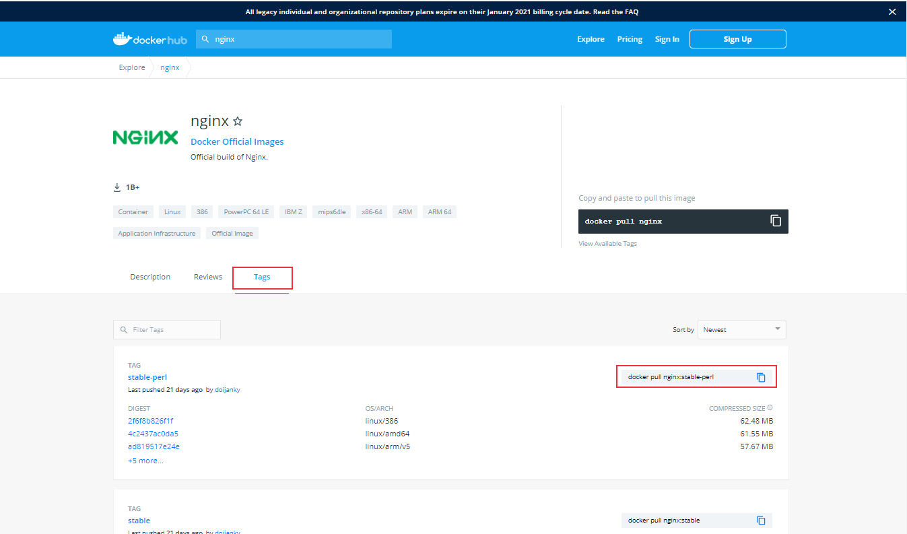
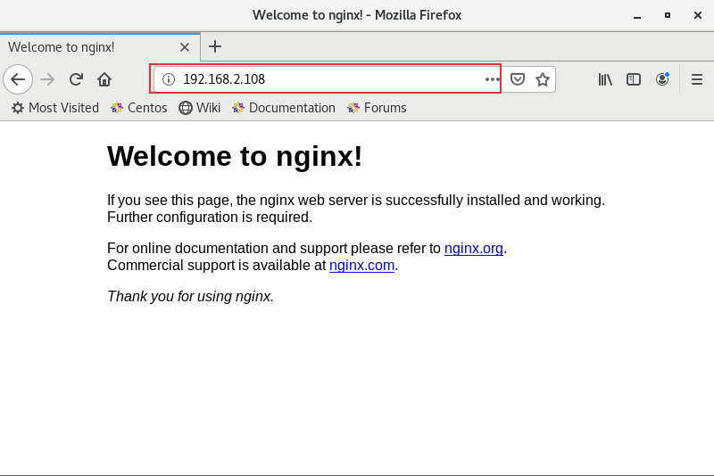
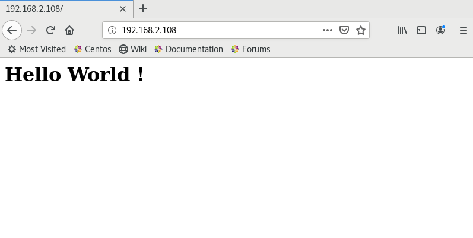

# Docker常用命令
本文介绍常用Docker命令，以搭建Web服务器Nginx为例介绍docker相关命令。

<!--more-->

## 基本命令
查看Docker版本信息: 
```sh
$ docker version
```
查看Docker系统信息: 
```sh
$ docker info
```
从Docker Hub查找镜像
```sh
$ docker search 镜像名
# 搜索nginx镜像
$ docker search nginx
```

拉取镜像
```sh
$ docker pull nginx
```
```sh
[root@server server]# docker pull nginx
Using default tag: latest
latest: Pulling from library/nginx
a076a628af6f: Pull complete 
0732ab25fa22: Pull complete 
d7f36f6fe38f: Pull complete 
f72584a26f32: Pull complete 
7125e4df9063: Pull complete 
Digest: sha256:10b8cc432d56da8b61b070f4c7d2543a9ed17c2b23010b43af434fd40e2ca4aa
Status: Downloaded newer image for nginx:latest
docker.io/library/nginx:latest
[root@server server]# 
```

下载指定版本的镜像
```sh
$ docker pull nginx:1.19.6
```
镜像的可用版本可在docker hub中查看：[https://hub.docker.com/](https://hub.docker.com/) ：


## 镜像管理

查看所有已下载镜像
```sh
$ docker images
```
```sh
[root@server server]#  docker images
REPOSITORY                   TAG               IMAGE ID       CREATED         SIZE
nginx                        latest            f6d0b4767a6c   3 weeks ago     133MB
app                          v1                db282454f6b3   7 months ago    83.1MB
<none>                       <none>            1acc89e1a291   7 months ago    152MB
bitnami/mariadb              latest            08498502c6b7   7 months ago    319MB
bitnami/testlink             latest            41feee91d195   7 months ago    826MB
prom/prometheus              latest            39d1866a438a   7 months ago    142MB
mysql                        5.7               9cfcce23593a   7 months ago    448MB
python                       3.7-alpine        6a5ca85ed89b   8 months ago    72.5MB
jenkins/jenkins              lts               5d1103b93f92   8 months ago    656MB
[root@server server]#  
```

删除镜像
```sh
$ docker rmi nginx:latest
# 或者使用IMAGE ID
$ docker rmi f6d0b4767a6c
# 强制删除镜像
$ docker rmi -f f6d0b4767a6c
```

标记本地镜像
```sh
$ docker tag nginx:latest nginx:test
# 修改镜像名称
$ docker tag nginx:latest nginx_test
```
```sh
[root@server server]# docker images
REPOSITORY                   TAG               IMAGE ID       CREATED         SIZE
nginx                        latest            f6d0b4767a6c   3 weeks ago     133MB
nginx                        test              f6d0b4767a6c   3 weeks ago     133MB
[root@server server]# docker tag nginx:latest nginx_test
REPOSITORY                   TAG               IMAGE ID       CREATED         SIZE
nginx                        latest            f6d0b4767a6c   3 weeks ago     133MB
nginx                        test              f6d0b4767a6c   3 weeks ago     133MB
nginx_test                   latest            f6d0b4767a6c   3 weeks ago     133MB
[root@server server]# docker rmi nginx:test
Untagged: nginx:test
[root@server server]# docker rmi nginx_test:latest
Untagged: nginx_test:latest
```

将指定镜像打包成 tar 归档文件
```sh
$ docker save nginx > nginx_test.tar
$ docker save nginx -o nginx_test.tar
```
导入打包的镜像
```sh
$ docker load < nginx_test.tar
```

查看镜像创建历史
```sh
$ docker history nginx
```


## 容器管理
运行容器
```sh
# 开启nginx服务
$ docker run -p 80:80 -d --name=nginx nginx:latest 
```
**-d:** 后台运行容器，并返回容器ID
**--name:** 为容器指定一个名称
**-p:** 指定端口映射：主机(宿主)端口:容器端口
**-v：**挂载目录，将主机的目录映射到容器目录

```sh
[root@server server]# docker run -p 80:80 -d --name=nginx nginx:latest
651ce76dd80fa58e3cdf2abeb9c08662bfcf68176738bb3881d0bcb851aa1a11
[root@server server]# 
```
浏览器输入服务器IP地址


挂载目录
```sh
# 将主机目录/home/server/nginx/html映射到容器目录/usr/share/nginx/html
$ docker run -p 80:80 -d --name=nginx -v /home/server/nginx/html:/usr/share/nginx/html nginx:latest 
```
在主机目录/home/server/nginx/html下新建一个index.html文件，输入内容：`<h1>Hello World !</h1>`
```sh
[root@server server]# cd /home/haiyong/nginx/html
[root@server html]# vim index.html
[root@server html]# cat index.html 
<h1>Hello World !</h1>
[root@server html]# 
```
浏览器刷新



查看运行的容器:
```sh
$ docker ps
$ docker ps -a
```

```sh
[root@server server]# docker ps
CONTAINER ID   IMAGE          COMMAND                  CREATED         STATUS         PORTS                NAMES
651ce76dd80f   nginx:latest   "/docker-entrypoint.…"   6 minutes ago   Up 6 minutes   0.0.0.0:80->80/tcp   nginx
[root@server server]# docker ps -a
CONTAINER ID   IMAGE                 COMMAND                  CREATED         STATUS                    PORTS                                              NAMES
651ce76dd80f   nginx:latest          "/docker-entrypoint.…"   8 minutes ago   Up 7 minutes              0.0.0.0:80->80/tcp                                 nginx
3bab7ac2a2af   jenkins/jenkins:lts   "/sbin/tini -- /usr/…"   6 months ago    Exited (255) 8 days ago   0.0.0.0:8080->8080/tcp, 0.0.0.0:50000->50000/tcp   jenkins
2c5ae10a7543   mysql:5.7             "docker-entrypoint.s…"   6 months ago    Exited (255) 8 days ago   0.0.0.0:3306->3306/tcp, 33060/tcp                  mysql-test
[root@server server]# 
```

查看容器中运行的进程
```sh
$ docker top nginx
```
```sh
[root@server server]# docker top nginx
UID                 PID                 PPID                C                   STIME               TTY                 TIME                CMD
root                118225              118205              0                   22:58               ?                   00:00:00            nginx: master process nginx -g daemon off;
101                 118284              118225              0                   22:58               ?                   00:00:00            nginx: worker process
```

实时监控容器资源消耗
```sh
$ docker stats nginx
```
```sh
[root@server server]# docker stats nginx
CONTAINER ID   NAME      CPU %     MEM USAGE / LIMIT     MEM %     NET I/O           BLOCK I/O         PIDS
651ce76dd80f   nginx     0.00%     1.492MiB / 1.777GiB   0.08%     3.97kB / 3.66kB   73.7kB / 24.6kB   2
CONTAINER ID   NAME      CPU %     MEM USAGE / LIMIT     MEM %     NET I/O           BLOCK I/O         PIDS
651ce76dd80f   nginx     0.00%     1.492MiB / 1.777GiB   0.08%     3.97kB / 3.66kB   73.7kB / 24.6kB   2
CONTAINER ID   NAME      CPU %     MEM USAGE / LIMIT     MEM %     NET I/O           BLOCK I/O         PIDS
651ce76dd80f   nginx     0.00%     1.492MiB / 1.777GiB   0.08%     3.97kB / 3.66kB   73.7kB / 24.6kB   2
CONTAINER ID   NAME      CPU %     MEM USAGE / LIMIT     MEM %     NET I/O           BLOCK I/O         PIDS
```

查看容器日志
```sh
$ docker logs -f nginx
```
获取容器/镜像的元信息
```sh
$ docker inspect nginx
$ docker inspect -f '{{.Id}}' nginx
```
**-f ：** 格式化字符串，输出格式使用Go语言模板。
```sh
[root@server server]# docker inspect nginx
[
    {
        "Id": "651ce76dd80fa58e3cdf2abeb9c08662bfcf68176738bb3881d0bcb851aa1a11",
        "Created": "2021-02-02T14:58:47.047835997Z",
        "Path": "/docker-entrypoint.sh",
        "Args": [
            "nginx",
            "-g",
            "daemon off;"
        ],
        "State": {
            "Status": "running",
            "Running": true,
            "Paused": false,
            "Restarting": false,
            "OOMKilled": false,
            "Dead": false,
            "Pid": 118225,
            "ExitCode": 0,
            "Error": "",
            "StartedAt": "2021-02-02T14:58:48.290043299Z",
            "FinishedAt": "0001-01-01T00:00:00Z"
        },
............................
[root@server server]# docker inspect -f '{{.Id}}' nginx
651ce76dd80fa58e3cdf2abeb9c08662bfcf68176738bb3881d0bcb851aa1a11

[root@server server]# docker inspect -f '{{.State.StartedAt}}' nginx
2021-02-02T14:58:48.290043299Z
```

`docker inspect`返回的容器信息中记录了容器的磁盘挂载目录，可以使用grep命令筛选出`Mounts`字段内容：

```bash
$ docker inspect nginx | grep Mounts -A 10
        "Mounts": [
            {
                "Type": "bind",
                "Source": "/home/server/nginx/html",
                "Destination": "/usr/share/nginx/html",
                "Mode": "",
                "RW": true,
                "Propagation": "rprivate"
            }
        ],
        "Config": {
```


查看容器内文件结构及更改

```sh
$ docker diff nginx
```
```sh
[root@server server]# docker diff webserver
C /etc
C /etc/nginx
C /etc/nginx/conf.d
C /etc/nginx/conf.d/default.conf
C /root
A /root/.bash_history
C /var
C /var/cache
C /var/cache/nginx
A /var/cache/nginx/client_temp
A /var/cache/nginx/fastcgi_temp
A /var/cache/nginx/proxy_temp
A /var/cache/nginx/scgi_temp
A /var/cache/nginx/uwsgi_temp
C /run
A /run/nginx.pid
```
**A：**添加了文件或目录
**B：**文件或目录被删除
**C：**文件或目录被修改


启动，停止容器
```sh
# 启动已经被停止的容器
$ docker start nginx

# 重启容器
$ docker restart nginx

# 暂停容器中所有的进程
$ docker pause nginx

# 恢复容器中所有的进程
$ docker unpause nginx

# 杀掉一个运行中的容器
$ docker kill nginx

# 停止一个运行中的容器
$ docker stop nginx

# 删除容器
$ docker rm nginx

# 强制删除容器
$ docker rm -f nginx
```

```sh
[root@server server]# docker ps
CONTAINER ID   IMAGE          COMMAND                  CREATED        STATUS        PORTS                NAMES
651ce76dd80f   nginx:latest   "/docker-entrypoint.…"   21 hours ago   Up 21 hours   0.0.0.0:80->80/tcp   nginx
[root@server server]# docker stop nginx
nginx
[root@server server]# docker ps
CONTAINER ID   IMAGE     COMMAND   CREATED   STATUS    PORTS     NAMES
[root@server server]# docker start nginx
nginx
[root@server server]# docker ps
CONTAINER ID   IMAGE          COMMAND                  CREATED        STATUS        PORTS                NAMES
651ce76dd80f   nginx:latest   "/docker-entrypoint.…"   21 hours ago   Up 1 second   0.0.0.0:80->80/tcp   nginx
[root@server server]# docker rm nginx
Error response from daemon: You cannot remove a running container 651ce76dd80fa58e3cdf2abeb9c08662bfcf68176738bb3881d0bcb851aa1a11. Stop the container before attempting removal or force remove
[root@server server]# docker stop nginx
nginx
[root@server server]# docker rm nginx  
nginx
[root@server server]# docker start nginx
Error response from daemon: No such container: nginx
Error: failed to start containers: nginx
[root@server server]# docker run -p 80:80 -d --name=nginx nginx:latest 
e0abbac7464794b5f2fbd328b841aaa83ffeff6c2072324b584cbbee4c68c36f
```

## 容器交互
在容器中执行命令
```sh
$ docker exec -it nginx ls
# 开启一个交互模式的终端，exit退出
$ docker exec -it nginx bash
# 使用root账号进入容器
$ docker exec -it -u root nginx bash
```

```sh
[root@server server]# docker exec -it nginx ls     
bin   docker-entrypoint.d   home   media  proc  sbin  tmp
boot  docker-entrypoint.sh  lib    mnt    root  srv   usr
dev   etc                   lib64  opt    run   sys   var
[root@server server]# docker exec -it nginx echo "test"
test
[root@server server]# docker exec -it nginx bash
root@ad4c10c7cec2:/# ls
bin   dev                  docker-entrypoint.sh  home  lib64  mnt  proc  run   srv  tmp  var
boot  docker-entrypoint.d  etc                   lib   media  opt  root  sbin  sys  usr
root@ad4c10c7cec2:/# exit
exit
[root@haiyong haiyong]# 
```

复制文件
```sh
# 将容器文件拷贝到主机
$ docker cp nginx:/etc/hosts hosts

# 将主机文件拷贝到容器中
$ docker cp hosts nginx:/etc/hosts
```


