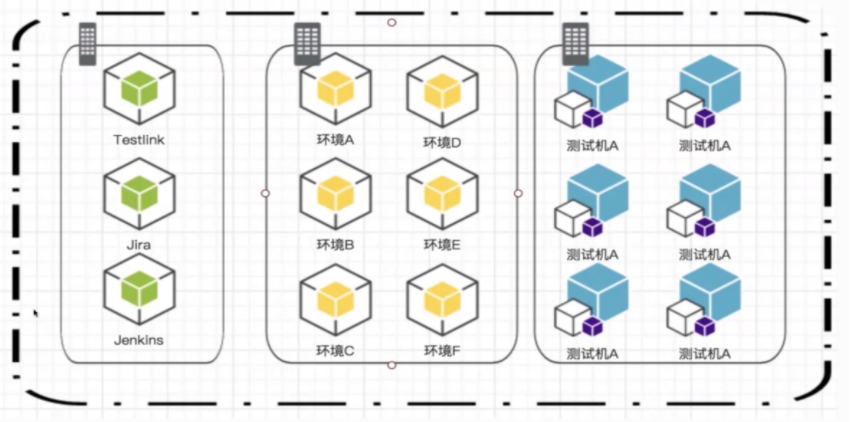
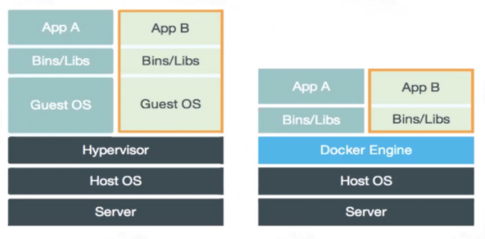
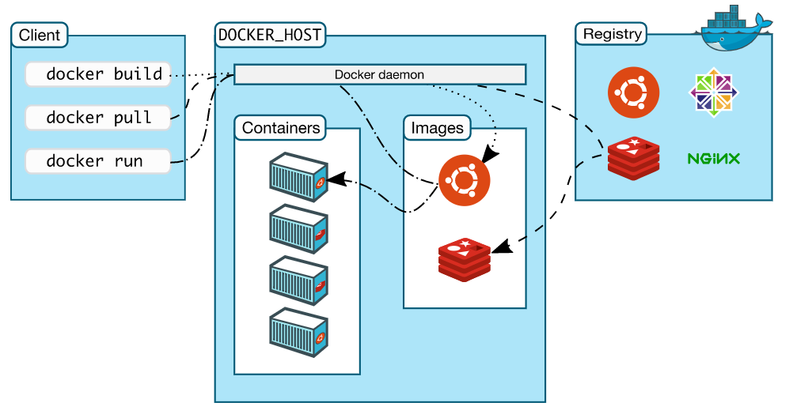
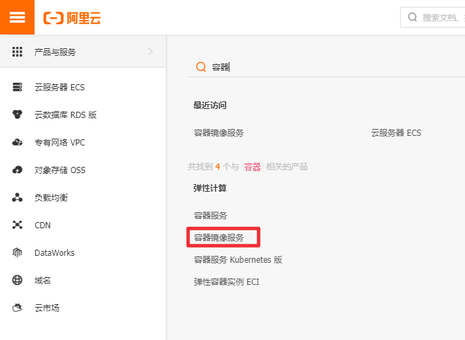
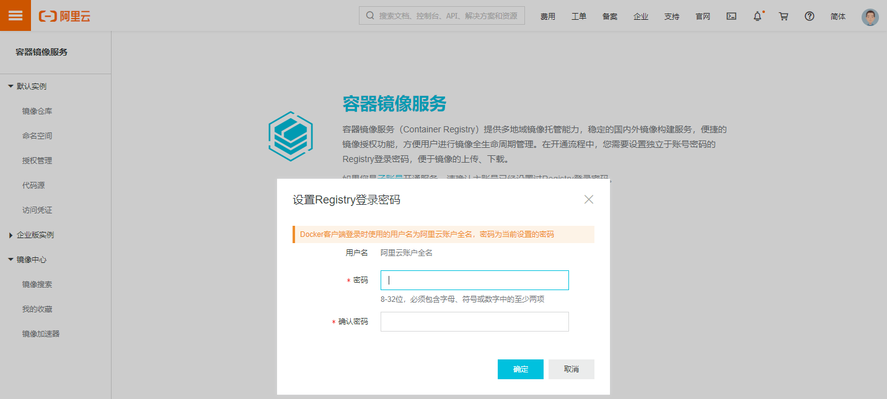
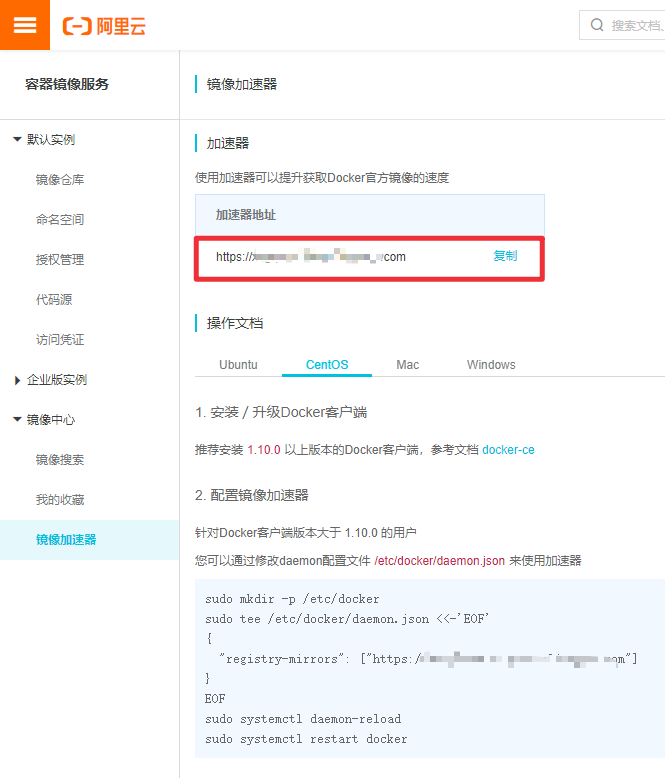

# Docker简介及安装
容器技术（Linux Container，LXC）是一种轻量级的虚拟化技术，容器镜像运行在一个隔离环境中，像集装箱一样，把应用封装起来，应用之间互不干扰，实现进程的隔离。Docker 是常用的一种容器技术，本文将简要介绍Docker及Docker安装方法。

<!--more-->

## Docker简介
### Docker是什么
Docker基于Go语言开发，在2013年正式发布，是一个是用于构建、部署和管理容器化应用程序的开源平台，Docker 允许开发人员将应用程序打包到容器中，容器将应用程序源代码、操作系统库以及所需的依赖结合在一起，可以发布到任何流行的系统中。Docker具有以下优点：
* 使开发人员能够使用简单命令自动化构建、部署、运行、更新容器，缩短开发及运行代码之间的周期，快速交付应用。
* 应用隔离：不同软件运行环境兼容依赖问题，每个容器都可以看作是一个不同的微服务，容器之间互不影响。
* 轻量级，比创建虚拟机快得多
* 运行环境可移植，容器镜像将应用运行环境，包括代码、依赖、资源文件等打包。



### Docker与虚拟机的区别
虚拟机（Virtual machine, VM)是对计算机系统的仿真，操作系统(OS)及其应用程序共享单个主机服务器的硬件资源，硬件是虚拟化的，每个虚拟机都有自己的底层操作系统。管理程序(hypervisor)位于硬件和虚拟机之间，负责创建和运行 VM 的软件、固件或硬件。

前面讲过，Docker也是一种虚拟化技术，它只虚拟化操作系统，而不像虚拟机那样虚拟化操作系统和硬件资源。主要区别如下：
* 容器与容器之间只是进程的隔离，通过名称空间隔离，而虚拟机是完全的资源隔离，可能更安全。
* 虚拟机的启动可能需要几分钟，Docker启动只需几秒钟甚至更短。
* 容器共享宿主操作系统的内核，而虚拟机使用完全独立的内核，需虚拟化内核。
* 虚拟机是操作系统和硬件的虚拟化，Docker是操作系统的虚拟化



### Docker Engine
Docker Engine 是一个客户机/服务器 (C/S架构) 应用，主要包括三个部分：
* server：守护进程(dockerd 命令)，Docker Daemon
* REST API：客户端与守护进程间的通信接口
* CLI：command line interface (CLI) ，命令行接口客户端（docker 命令）


CLI 使用 REST API 与 Docker Daemon 进行通信，实现对Docker Daemon的控制和交互。也可以使用 UNIX 套接字、网络接口进行通信。守护进程构建、运行和管理 Docker 对象（镜像、容器、网络和volumes）。Docker 客户机和守护进程可以在同一个系统上运行，也可以将 Docker 客户机连接到远程 Docker 守护进程。


<center><font size="2">https://docs.docker.com/get-started/overview/</font></center>

####  Docker daemon
Docker 守护进程(dockerd)是后台服务进程，是生存期较长的进程，负责监听 Docker API 请求，管理 Docker 对象。守护进程还可以与其他守护进程通信来管理 Docker 服务。

#### Docker client
Docker 客户端(docker)是 Docker 用户与 Docker 交互的主要方式，客户端将命令发送给守护进程，然后守护进程执行这些命令，Docker 客户端可以与多个守护进程进行通信。

#### Docker Images
Docker镜像是一个只读模板，其中包含创建 Docker 容器的说明。通常，一个镜像都可能依赖一个或多个下层的镜像组成的另一个镜像。Docker镜像可以从Docker仓库中下载，也可以自己创建（Dockerfile）。

#### Docker Registry
Docker仓库是集中存放Docker镜像的地方，默认公共仓库为 Docker Hub，也可以自己配置私人仓库。当使用 `docker pull`  或  `docker run` 命令时，将从配置的仓库中提取所需的镜像。使用 `docker push` 命令时，镜像将被推送到配置的仓库中。

#### Docker Containers
Docker容器是镜像运行后的进程，是镜像的可运行实例，默认情况下，容器之间是隔离的。

## Docker安装
Docker安装可参考官方文档：[https://docs.docker.com/engine/install/](https://docs.docker.com/engine/install/)
### Windows 10
下载地址 : [https://hub.docker.com/editions/community/docker-ce-desktop-windows](https://hub.docker.com/editions/community/docker-ce-desktop-windows)

### Linux
安装方法有两种，一种是设置docker源进行安装（推荐方法），另一种是是下载安装包（CentOS和Ubuntu对应RPM、DEB包）进行手动安装，一般在安装主机没有网络的情况下使用这种方法。（RPM、DEB包介绍及安装方法可参考**Linux系统介绍**）

下面介绍一下CentOS下的docker安装方法（也可参考官方文档：[https://docs.docker.com/engine/install/centos/](https://docs.docker.com/engine/install/centos/)），Ubuntu系统下docker的安装参考官方文档：[https://docs.docker.com/engine/install/ubuntu/](https://docs.docker.com/engine/install/ubuntu/)

要求CentOS 7 或者 CentOS 8

#### 1. 卸载旧版本
```sh
$ sudo yum remove docker \
docker-client \
docker-client-latest \
docker-common \
docker-latest \
docker-latest-logrotate \
docker-logrotate \
docker-engine
```
#### 2. 安装依赖、添加源	
```sh
# 安装yum-utils包
$ sudo yum install -y yum-utils device-mapper-persistent-data lvm2
# 设置yum源
$ sudo yum-config-manager --add-repo https://download.docker.com/linux/centos/docker-ce.repo
# a
$ sudo yum-config-manager --add-repo http://mirrors.aliyun.com/docker-ce/linux/centos/docker-ce.repo
```
#### 3. 安装Docker Engine
安装最新版本的Docker Engine 和 containerd
```sh
$ sudo yum install docker-ce docker-ce-cli containerd.io
```
或者安装指定版本：
```sh
# 列出可用版本
$ yum list docker-ce --showduplicates | sort -r
docker-ce.x86_64            3:20.10.2-3.el7                    docker-ce-stable 
docker-ce.x86_64            3:20.10.2-3.el7                    @docker-ce-stable
docker-ce.x86_64            3:20.10.1-3.el7                    docker-ce-stable 
docker-ce.x86_64            3:20.10.0-3.el7                    docker-ce-stable 
# 安装指定版本
$ sudo yum install docker-ce-20.10.2 docker-ce-cli-20.10.2 containerd.io
```
#### 4. 启动Docker
```sh
# 启动
$ sudo systemctl start docker
# 开机启动
$ sudo systemctl enable docker
```
#### 5. 检验Docker Engine是否安装成功
```sh
# 运行hello-world镜像
$ sudo docker run hello-world
# 或者 查看docker版本
$ docker version
```


### 配置阿里云镜像加速器
默认是从Docker Hub下载镜像，为了更快的下载docker镜像，可以配置国内的镜像服务器，下面介绍阿里云镜像配置方法。

阿里云控制台地址：[https://homenew.console.aliyun.com/](https://homenew.console.aliyun.com/)
1. 进入容器镜像服务


2. 设置登陆密码
首次使用需要设置密码：


3. 设置镜像加速   
点击进入镜像加速器：[https://cr.console.aliyun.com/cn-hangzhou/instances/mirrors](https://cr.console.aliyun.com/cn-hangzhou/instances/mirrors)
	
	选择对应的操作系统，按照操作步骤进行操作。


## 常见问题
报错信息：
```bash
Failed to Setup IP tables: Unable to enable SKIP DNAT rule:  (iptables failed: iptables --wait -t nat -I DOCKER -i br-48bc3090b33e -j RETURN: iptables: No chain/target/match by that name.
```
原因是关闭防火墙之后docker需要重启：
```bash
service docker restart
```

参考：
> 1. [https://docs.docker.com/get-started/overview/](https://docs.docker.com/get-started/overview/)


