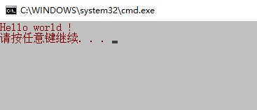

# 一些windows批处理脚本

本文记录一些平时使用到的bat语法。

## 1.  获取当前目录
获取当前路径
```bash
@echo off

set DriveLetter=%~d0
echo %DriveLetter%

set filePath=%~p0
echo %filePath%
 
set filePath=%DriveLetter%%filePath%
echo current path: %filePath%
echo current path: %cd%

pause
```

执行结果：
```bash
D:
\ProgramWorkspace\ShellNotes\Windows\
current path: D:\ProgramWorkspace\ShellNotes\Windows\
current path: D:\ProgramWorkspace\ShellNotes\Windows
```

## 2. 获取目录中的文件和子目录

可以使用 `dir` 命令来获取某个目录下的文件或者子目录文件，使用 `dir /?` 命令查看帮助文档。

下面介绍几种使用方法：

```bash
# 显示当前目录下的文件、子目录以及子目录下的文件
dir /a /b /s

# 只显示当前目录下的文件
dir /b /a-d

# 从大到小排序
dir /b /a-d /o-s

# 显示后缀为bat的文件
dir /b /a-d /o-s *.bat
```

bat脚本打印当前目录下的bat文件：

```bash
@echo off

for /f "delims=\" %%a in ('dir /b /a-d /o-s "%cd%\*.bat"') do (
  echo %%a
)

pause
```

## 3. 读取配置文件

创建一个配置文件 `config.ini` :

```ini
host=192.168.0.1
port=8100
```

读取host和port的值：

```bash
@echo off

:: 读取配置
for /f "tokens=1,2 delims==" %%a in (config.ini) do (
	if %%a==host set host=%%b
	if %%a==port set port=%%b
) 

echo host: %host%
echo port: %port%

pause
```

运行结果：

```
host: 192.168.0.1
port: 8100
```


## 4. 清空文件内容

清空 test.log 文件中的内容：

```bash
cd.>test.log
```

linux shell清空文件内容方法参考[Linux常用命令：文件操作命令](https://blog.csdn.net/u010698107/article/details/111501686)

## 5. 打印换行

使用 `echo.` 打印换行：

```bash
@echo off

echo hello
echo.
echo world

pause 
```


##  6. 设置窗口显示颜色

语法：
```bash
COLOR [attr]
```
颜色属性 attr 可用于设置背景和前景的设置，可以设置的颜色：

- 0 = 黑色
- 1 = 蓝色
- 2 = 绿色
- 3 = 浅绿色
- 4 = 红色
- 5 = 紫色
- 6 = 黄色
- 7 = 白色
- 8 = 灰色
- 9 = 淡蓝色
- A = 淡绿色
- B = 淡浅绿色
- C = 淡红色
- D = 淡紫色
- E = 淡黄色
- F = 亮白色

例如设置窗口为白色背景，红色文字：

```bash
@echo off

color 74

echo Hello world !

pause
```
效果：



