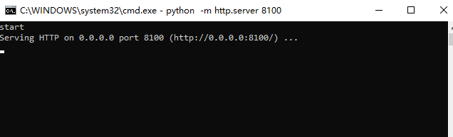
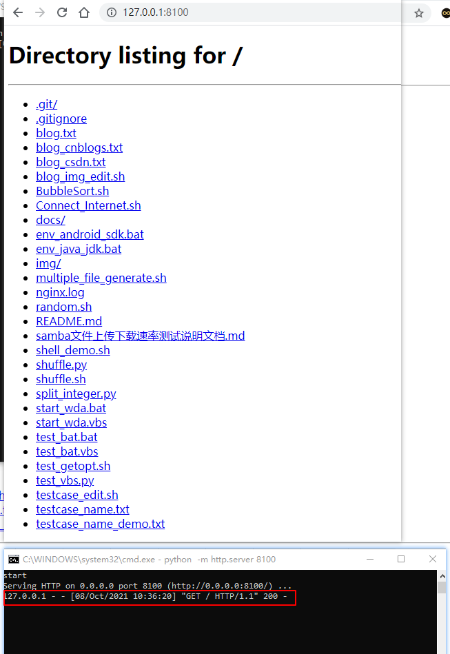

# VBSscript实现后台运行Windows bat脚本

VBScript 是Visual Basic 语言的轻量级版本，本文介绍使用VBS实现在后台运行bat脚本。

<!--more-->


先编写一个简单的bat脚本（test_bat.bat）：使用Python打开一个简单的 http 服务器
```bash
@echo off

echo start
cmd /k "python -m http.server 8100"
echo end
pause
```

下面来测试一下这个脚本，双击test_bat.bat，会打开如下窗口：



浏览器访问 http://127.0.0.1:8100/



可以看到HTTP服务搭建成功。

也可以使用 `netstat` 命令查看8100端口对应服务是否启动：
```bash
$ netstat -nao | findstr 8100
  TCP    0.0.0.0:8100           0.0.0.0:0              LISTENING       17220
  TCP    127.0.0.1:1024         127.0.0.1:8100         TIME_WAIT       0
$ 
$ tasklist | findstr 17220
python.exe                   17220 Console                    1     18,800 K
```

如何实现在后台运行呢？可以使用VBScript来实现。

编写vbs文件test_bat.vbs：
```bash
Set WshShell = CreateObject("WScript.Shell") 
WshShell.Run chr(34) & "test_bat.bat" & Chr(34), 0
```
`0` 表示后台运行，如果设置为1，会显示cmd窗口。

双击test_bat.vbs运行，浏览器访问 http://127.0.0.1:8100/ 查看服务是否启动 或者使用如下命令：
```bash
$ netstat -nao | findstr 8100
  TCP    0.0.0.0:8100           0.0.0.0:0              LISTENING       1788

$ tasklist | findstr 1788
python.exe                    1788 Console                    1     18,680 K
```
可以看到HTTP server启动成功。

杀掉HTTP server：
```bash
$ taskkill -pid 1788 -f -t
SUCCESS: The process with PID 1788 (child process of PID 18576) has been terminated.
```

如果bat脚本需要传入参数怎么实现呢？可以使用WScript.Arguments对象获取参数，下面直接给出实现方式，将端口号作为参数传入：

test_bat2.bat：
```bash
@echo off

echo start
python -m http.server %1
echo end

pause
```
test_bat2.vbs：
```bash
dim args
Set args = WScript.Arguments
Set WshShell = CreateObject("WScript.Shell") 

WshShell.run "cmd /c " &args(0) &args(1),0
```

cmd命令窗口运行
```bash
$ test_bat2.vbs test_bat2.bat " 8100"
```

在实际使用过程中，通常不会手动双击运行脚本，比如在自动化测试中，需要自动启动一个[tshark抓包](https://blog.csdn.net/u010698107/article/details/112727035)程序, 我们只需要它在后台运行。下面举一个Python运行bat脚本的示例程序。

```python
def start_bat(self, port):
    """启动 HTTP server
    :port: 服务端口号
    """
    self.stop_process(port)
    dir_path = os.path.dirname(os.path.realpath(__file__))  # 当前路径
    print(dir_path)

    os.system(f'{dir_path}/test_bat.vbs "{dir_path}/test_bat.bat" " {port}"')

    for l in range(3):
        sleep(3)
        if self.check_process(port):
            print("http server successfully")
            return True
    print("http server started failed")
    return False
```

完整代码：[https://github.com/hiyongz/ShellNotes/blob/main/test_vbs.py](https://github.com/hiyongz/ShellNotes/blob/main/test_vbs.py)


<center><b>--THE END--<b></center>

