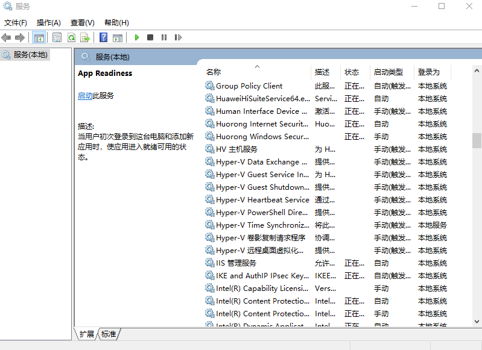

# 常用Windows cmd命令
本文列出一些常用的 windows cmd命令，使用`windows + r`键后输入命令或者打开cmd.exe命令提示符输入，其中cmd命令提示符可以通过使用`windows + r`键后输入cmd打开
<!--more-->

## 杀掉进程
```bash
$ taskkill /im chromedriver.exe /f
# 或者
$ wmic process where name="chromedriver.exe" call terminate
```
## 切换盘符目录
切换到其它盘
```bash
# 方法1
C:\Users\10287>d:

D:\>

# 方法2
C:\Users\10287>cd /d d:

D:\>
```

## 设置windows系统时区
参考：[https://winaero.com/blog/set-time-zone-windows-10/](https://winaero.com/blog/set-time-zone-windows-10/)
```c
tzutil /l  //查看所有可设置时区
tzutil /g //查看当前时区
tzutil /s "China Standard Time" //设置时区  
tzutil /s "China Standard Time_dstoff" //关闭夏令时
```

## 打开资源管理器
```bash
explorer
```

## 关机重启
`shutdown /?` 查看帮助信息
关机
```bash
shutdown -s -t 60 # 60s 后关机
rononce -p # 15s 后关机
shutdown -s -t 0 # 立即关机
shutdown -p # 立即关机
```
或者使用wmic命令：
```bash
wmic process call create shutdown.exe
```

重启
```bash
shutdown -r -t 60 # 60s 后重启
shutdown -r -t 0 # 立即重启
```
休眠
```bash
shutdown -h
```
在rononce -p、shutdown -s或者shutdown -r倒计时结束之前执行shutdown -a可以取消关机或者重启操作

按住 shift 并点重启可以使重启后进入 BIOS
## windows远程管理
```bash
mstsc
```
无法远程复制文件问题：
1. 结束进程rdpclip.exe
2. 重新开启进程：win + r 输入rdpclip.exe

## windows计算器
```bash
calc
```
## 打开记事本
```bash
notepad
```

## 打开控制面板
```bash
control
```
## 打开剪贴板
Win10：windows + v

## 打开屏幕键盘
```bash
osk
```

## 服务设置
```bash
services.msc
```

## 注册表编辑
```bash
regedt32
```

## 任务管理器
```bash
taskmgr
```

## 写字板
```bash
write
```

## 画图板
```bash
mspaint
```
## 防火墙
```bash
firewall.cpl
```
## 其它
重置 Windows 10 本地帐户密码：[https://support.microsoft.com/zh-cn/help/4028457/windows-10-reset-your-local-account-password](https://support.microsoft.com/zh-cn/help/4028457/windows-10-reset-your-local-account-password)


